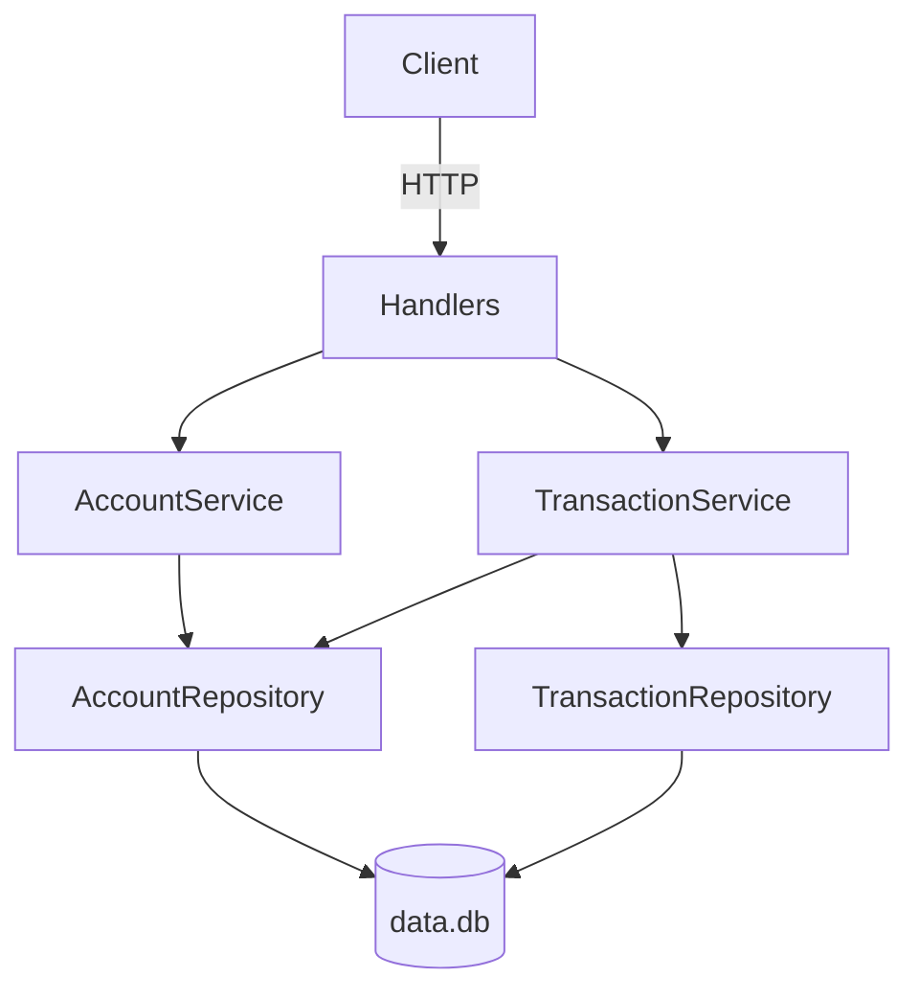

# Visa/Pismo Assessment API

REST API for managing accounts and financial transactions, built for the Visa/Pismo technical assessment.

**Module:** `github.com/ak2783934/visa-pismo-assessment`

## Project overview

This service lets you:

- Create accounts identified by a unique document number (e.g. CPF)
- Record transactions against an account with operation-type rules that enforce debit/credit sign

Persistence uses **SQLite** (`data.db`) with **WAL** journaling. The HTTP layer is **Gin**; data access uses the standard library **`database/sql`**.

## Architecture

Layered design with clear separation of concerns:

```text
HTTP (Gin handlers)
        ↓
Services (business rules)
        ↓
Repositories (database/sql)
        ↓
SQLite (data.db)
```



### Project layout

```text
visa-pismo-assessment/
├── cmd/server/main.go           # Entrypoint, wiring, routes
├── internal/
│   ├── account/                 # Account domain
│   ├── transaction/             # Transaction domain
│   └── database/                # DB open, WAL, migrations
├── docs/                        # Swagger/OpenAPI (generated)
├── pkg/response/                # JSON response helpers
├── migrations/001_init.sql      # Schema
├── Dockerfile
├── docker-compose.yml
└── Makefile
```

## API

Base URL: `http://localhost:8080/v1`

| Method | Path | Description |
|--------|------|-------------|
| `POST` | `/v1/accounts` | Create account |
| `GET` | `/v1/accounts/:id` | Get account by ID |
| `POST` | `/v1/transactions` | Create transaction |

### Operation types

| ID | Type | Stored sign |
|----|------|-------------|
| 1 | Normal purchase | Negative |
| 2 | Purchase with installments | Negative |
| 3 | Withdrawal | Negative |
| 4 | Credit voucher | Positive |

If the client sends a **positive** amount, the service normalizes it to the correct sign (e.g. type `1` + `100` → `-100`).

### API examples

**Create account**

```bash
curl -s -X POST http://localhost:8080/v1/accounts \
  -H "Content-Type: application/json" \
  -d '{"document_number":"12345678900"}'
```

Response `201`:

```json
{
  "account_id": 1,
  "document_number": "12345678900"
}
```

**Get account**

```bash
curl -s http://localhost:8080/v1/accounts/1
```

Response `200`:

```json
{
  "account_id": 1,
  "document_number": "12345678900"
}
```

**Create transaction (normal purchase)**

```bash
curl -s -X POST http://localhost:8080/v1/transactions \
  -H "Content-Type: application/json" \
  -d '{
    "account_id": 1,
    "operation_type_id": 1,
    "amount": 100
  }'
```

Response `201` (amount stored as `-100`):

```json
{
  "transaction_id": 1,
  "account_id": 1,
  "operation_type_id": 1,
  "amount": -100,
  "event_date": "2026-05-18T12:00:00Z"
}
```

**Credit voucher (positive amount)**

```bash
curl -s -X POST http://localhost:8080/v1/transactions \
  -H "Content-Type: application/json" \
  -d '{
    "account_id": 1,
    "operation_type_id": 4,
    "amount": 50
  }'
```

Response `201` (amount stored as `+50`):

```json
{
  "transaction_id": 2,
  "account_id": 1,
  "operation_type_id": 4,
  "amount": 50,
  "event_date": "2026-05-18T12:00:00Z"
}
```

### HTTP status codes

| Status | When |
|--------|------|
| `201` | Resource created |
| `200` | Account found |
| `400` | Invalid input / validation error |
| `404` | Account or transaction account not found |
| `409` | Duplicate document number |
| `500` | Unexpected server error |

Errors use: `{"error": "message"}`

## Swagger

Interactive API docs are available at [http://localhost:8080/swagger/index.html](http://localhost:8080/swagger/index.html) when the server is running.

Regenerate specs after changing handler annotations:

```bash
make swagger
```

## Configuration

| Variable | Default | Description |
|----------|---------|-------------|
| `DB_PATH` | `data/data.db` | Path to the SQLite database file |

Copy `.env.example` to `.env` and adjust as needed. The `.env` file is gitignored; `.env.example` is committed as a reference.

```bash
cp .env.example .env
```

## How to run locally

**Requirements**

- Go 1.25+
- C toolchain (for `mattn/go-sqlite3` / CGO)

From the project root (so `migrations/001_init.sql` resolves):

```bash
make run
```

Or:

```bash
go run ./cmd/server
```

The server listens on **http://localhost:8080**. SQLite file `data.db` is created in the working directory.

## How to run tests

```bash
make test
```

Or:

```bash
go test ./...
```

Tests use testify mocks for the repository layer and `httptest` for end-to-end handler coverage. All tests follow table-driven format.

Format code:

```bash
make fmt
```

Generate Swagger docs:

```bash
make swagger
```

## Docker instructions

Build and run with Compose (persists `data.db` in a named volume):

```bash
make docker
```

Or:

```bash
docker compose up --build
```

API available at `http://localhost:8080`.

Stop containers:

```bash
docker compose down
```

## Design decisions

- **Layered architecture** — Handlers stay thin; validation and rules live in services; SQL stays in repositories. This keeps domains testable and easy to extend.
- **`database/sql` + repository interfaces** — No ORM; explicit SQL and small interfaces allow swapping SQLite for another store later.
- **SQLite with WAL** — Simple local persistence, single-file deployment, and better concurrent read behavior via `PRAGMA journal_mode = WAL`.
- **Connection pool `MaxOpenConns(1)`** — Matches SQLite’s single-writer model and avoids locking surprises.
- **Sign normalization in the service** — Clients may send positive amounts; operation types `1–3` debit, `4` credits. Magnitude is taken with `math.Abs`, then the correct sign is applied.
- **`EventDate` set server-side** — `time.Now().UTC()` on create for consistent timestamps.
- **CGO SQLite driver** — `github.com/mattn/go-sqlite3` is mature and widely used; Docker build uses a multi-stage image with CGO enabled in the builder.


